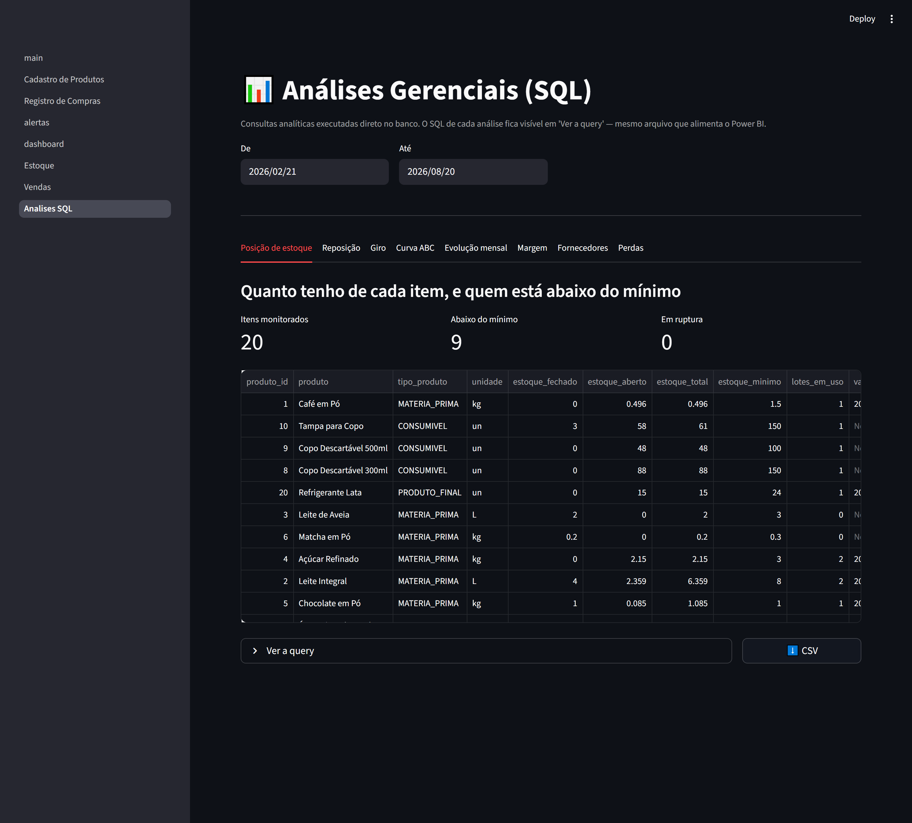
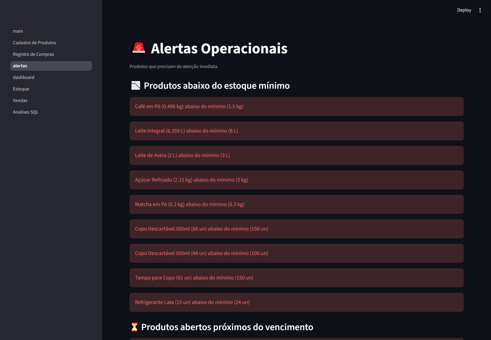
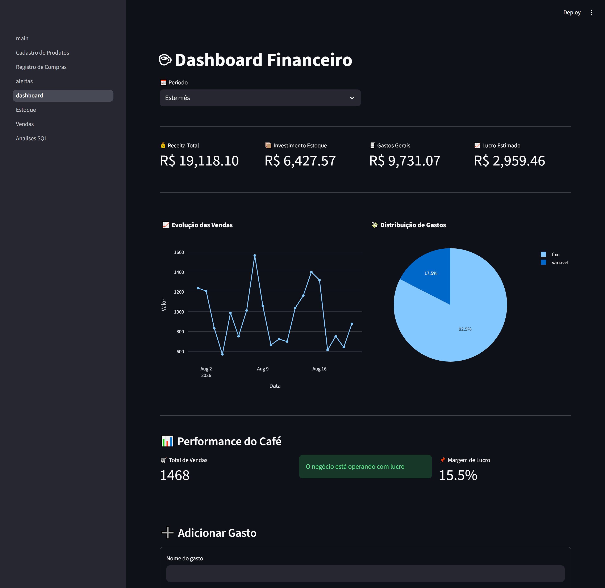
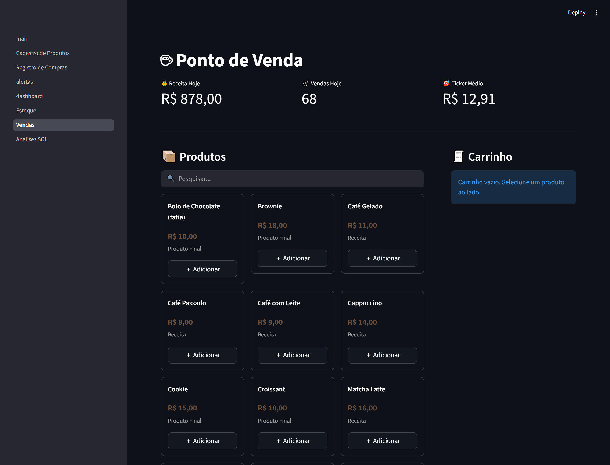
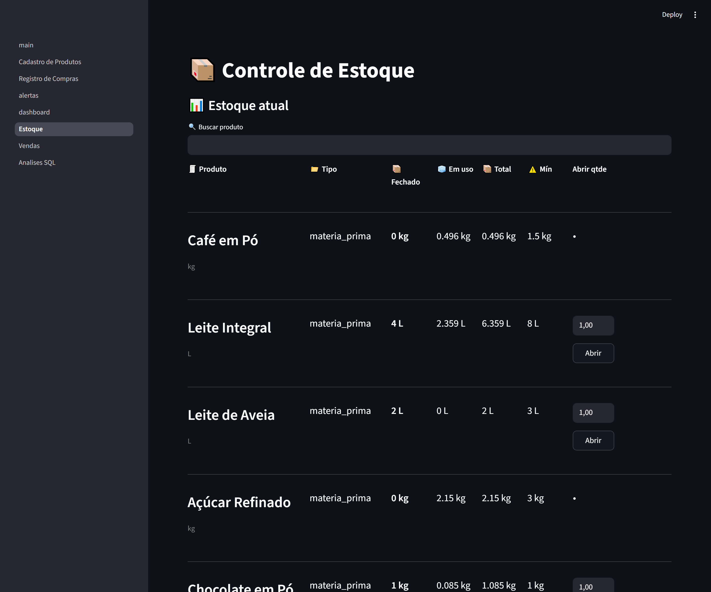

# ☕ Cafezinho — Controle de Estoque e Análise Operacional

Sistema de gestão de estoque para cafeterias, com camada analítica em SQL e dashboard
gerencial em Power BI sobre os mesmos dados.



---

## O problema

Cafeteria pequena não perde dinheiro numa tacada só — perde em vazamentos que ninguém
mede:

- **Comprar no escuro.** A reposição é feita "quando o dono olha a prateleira e acha que
  está acabando". O resultado é ruptura no fim de semana movimentado e excesso de
  perecível que vence na segunda-feira.
- **Perda invisível.** Some produto todo mês, mas ninguém sabe se foi validade (compra
  demais) ou quebra no manuseio (falta de processo). São problemas diferentes, com
  soluções diferentes, tratados como o mesmo "sumiço".
- **Cardápio no achismo.** O item mais vendido não é necessariamente o mais lucrativo.
  Sem custo de ficha técnica, o preço é definido por comparação com o vizinho.
- **Fornecedor sem comparação.** Compra-se de quem atende o telefone, sem histórico de
  quanto cada um cobrou pelo mesmo insumo.

## O que o sistema entrega

| Decisão que o dono precisa tomar | O que o sistema responde |
|---|---|
| "O que eu compro hoje?" | Lista de reposição com quantidade sugerida a partir do **consumo médio real** dos últimos 30 dias, não de um mínimo fixo |
| "Onde estou perdendo dinheiro?" | Perda valorizada em reais, separada por causa (vencimento x quebra x falha de reposição) |
| "Que item do cardápio me sustenta?" | Curva ABC de faturamento + margem por item, calculada a partir do custo real da ficha técnica |
| "Estou pagando caro?" | Comparação de preço por fornecedor do mesmo insumo, com o custo de oportunidade em reais |
| "Estou crescendo ou desperdiçando mais?" | Consumo de insumo por real faturado, mês a mês |

O princípio que sustenta tudo: **estoque nunca é um campo editável.** É sempre derivado
de um ledger imutável de movimentações. Não existe "corrigir o número na tela" — existe
registrar o ajuste, com motivo, e o saldo se recalcula. É o que torna o histórico
auditável e o cálculo de giro possível.

---

## Screenshots

| Alertas operacionais | Dashboard financeiro |
|---|---|
|  |  |

| PDV (vendas) | Estoque e lotes |
|---|---|
|  |  |

> Para regenerar as imagens depois de mudar a interface:
> `python scripts/capturar_screenshots.py` (com o app rodando).

---

## ⚠️ Sobre os dados

**Todos os dados deste repositório são sintéticos.** São gerados por
`scripts/gerar_dados_sinteticos.py`, que simula 6 meses de operação de uma cafeteria:
vendas com sazonalidade e crescimento, compras com variação de preço e inflação,
perdas por validade e quebra, ajustes de contagem mensal, gastos fixos e variáveis, e
até um período de loja fechada para reforma.

Nenhum número aqui vem de um negócio real. A simulação existe porque um sistema de
estoque só demonstra alguma coisa com histórico — giro, curva ABC e evolução de consumo
não significam nada com três registros de teste.

O banco de dados **não é versionado** (`.gitignore`). Quem clonar o repositório gera o
próprio, com o mesmo seed determinístico (`SEED = 42`) — os números serão idênticos aos
das imagens acima.

---

## Como rodar

**Pré-requisitos:** Python 3.11+.

```bash
git clone https://github.com/treino258/controle-de-estoque.git
cd controle-de-estoque

python -m venv .venv
.venv\Scripts\activate          # Windows
source .venv/bin/activate       # Linux / macOS

pip install -r requirements.txt
```

**Com dados de demonstração** (recomendado para avaliar o projeto):

```bash
python scripts/gerar_dados_sinteticos.py
```

Cria o banco do zero e popula 6 meses de operação (~35 mil movimentações, ~11 mil
vendas). Leva alguns minutos.

**Do zero, sem dados** (é o que um cliente real recebe):

```bash
python scripts/reset_database.py
```

**Subir o app:**

```bash
streamlit run app/main.py
```

### Executável Windows (entrega ao cliente)

Para entregar a um cliente que não tem Python: o build gera um `.exe` autocontido em
`dist/ControleDeEstoque` (não versionado). Duplo clique abre o navegador em
`http://127.0.0.1:8501`; o banco é criado ao lado do `.exe`, vazio — nenhum dado de
demonstração vai junto. Para gerar:

```bash
python -m venv .venv_build
.venv_build\Scripts\activate
pip install -r requirements.txt pyinstaller
pyinstaller ControleDeEstoque.spec
```

---

## Camada analítica em SQL

As análises gerenciais **não passam pelo ORM.** Ficam em arquivos `.sql` versionados na
pasta [`sql/`](sql/), executados com parâmetros ligados via `text()`:

| Arquivo | Pergunta que responde | Técnicas |
|---|---|---|
| [`01_posicao_estoque.sql`](sql/01_posicao_estoque.sql) | Quanto tenho de cada item, quem está abaixo do mínimo | CTEs, `CASE` com sinal por tipo de movimento, `LEFT JOIN` |
| [`02_alertas_reposicao.sql`](sql/02_alertas_reposicao.sql) | O que comprar hoje e quanto | Subqueries correlacionadas, `UNION ALL` de dois tipos de alerta, `JULIANDAY` |
| [`03_giro_estoque.sql`](sql/03_giro_estoque.sql) | O que gira e o que trava capital | `SUM() OVER (PARTITION BY ... ORDER BY ...)` para saldo corrente reconstruído do ledger |
| [`04_curva_abc.sql`](sql/04_curva_abc.sql) | Quais itens sustentam o faturamento | Pareto com `ROW_NUMBER()`, `SUM() OVER ()` e acumulado |
| [`05_evolucao_mensal.sql`](sql/05_evolucao_mensal.sql) | Consumo acompanha a receita? | `LAG()` para variação MoM, média móvel de 3 meses, calendário sintético para não perder meses vazios |
| [`06_margem_por_receita.sql`](sql/06_margem_por_receita.sql) | O mais vendido é o mais lucrativo? | Self-join em `products` pela ficha técnica, `RANK()`, custo médio ponderado |
| [`07_desempenho_fornecedores.sql`](sql/07_desempenho_fornecedores.sql) | Estou pagando caro? | `MIN() OVER (PARTITION BY produto)` para comparar cada fornecedor contra os concorrentes do mesmo item |
| [`08_perdas_por_causa.sql`](sql/08_perdas_por_causa.sql) | Quanto jogo fora, e por quê | Normalização de texto livre em categorias, `RANK()` particionado por mês |

Rodar no terminal, sem subir o app:

```bash
python scripts/consultas_sql.py --todas
```

Ou uma específica, exportando o resultado:

```bash
python scripts/consultas_sql.py 04_curva_abc --csv abc.csv
```

As mesmas queries alimentam a página **Análises Gerenciais** dentro do app, onde o SQL
fica visível ao usuário em "Ver a query" — a regra de cálculo é auditável por quem toma
a decisão, não uma caixa-preta.

### Por que SQL aqui e ORM no resto

O ORM é a ferramenta certa para escrita transacional: registrar uma venda que desconta
sete ingredientes por FEFO em transação única é código de negócio, e ele precisa ser
testável e independente de dialeto.

Leitura analítica é o caso oposto. Curva ABC, saldo corrente por window function,
ranking particionado por produto — expressar isso em SQLAlchemy produz código mais longo,
menos legível e mais difícil de revisar do que o SQL equivalente. Além disso, uma query
em arquivo roda igual no DBeaver, no Power BI e na aplicação, e seu `git diff` é legível
por quem entende de dados sem entender de Python.

---

## Dashboard Power BI

Camada gerencial sobre os mesmos dados, em modelo estrela (2 dimensões + 4 fatos,
incluindo uma *periodic snapshot fact table* de estoque reconstruída dia a dia a partir
do ledger).

Os dados exportados e as ~18 medidas DAX estão prontos em [`powerbi/`](powerbi/), com
roteiro de montagem em [`powerbi/README.md`](powerbi/README.md).

```bash
python scripts/exportar_powerbi.py    # regera powerbi/dados/*.csv
```

> **Nota de transparência:** o repositório entrega os dados em modelo estrela e as
> medidas DAX, não um `.pbix` montado. Power BI Desktop não tem interface de linha de
> comando para autoria de relatórios — os visuais precisam ser montados à mão no
> aplicativo, seguindo o roteiro.

---

## Arquitetura

```
app/
├── pages/              # UI (Streamlit) — só chama services, nunca o banco
│   ├── 1_Cadastro_de_Produtos.py
│   ├── 2_Registro_de_Compras.py
│   ├── 3_alertas.py
│   ├── 4_dashboard.py
│   ├── 5_Estoque.py
│   ├── 6_Vendas.py               # PDV com carrinho e baixa FEFO
│   └── 7_Analises_SQL.py         # análises gerenciais, com o SQL exposto
│
├── services/           # Regras de negócio
│   ├── application_service.py    # fachada: uma função por caso de uso da UI
│   ├── stock_service.py          # saldos derivados, FEFO
│   ├── movement_services.py      # escrita no ledger
│   ├── recipe_service.py         # ficha técnica
│   ├── cost_service.py           # custo de receita
│   └── session_scope.py          # context manager transacional
│
├── repositories/       # Acesso a dados
│   ├── product_repository.py
│   ├── finance_repository.py
│   ├── movement_repository.py
│   ├── receita_repository.py
│   └── analytics_repository.py   # executa os .sql de sql/
│
├── models/             # Tabelas
│   ├── product.py, stock_movement.py, stock_lot.py
│   ├── sales.py, expenses.py, recipes.py
│   ├── tenant.py                 # preparado para multi-tenant
│   └── mixins.py
│
├── database/           # Engine, criação de schema, tenant padrão
└── utils/              # Conversão de unidade e formatação

sql/                    # Queries analíticas versionadas
tests/                  # Suíte pytest
powerbi/                # Modelo estrela + medidas DAX + roteiro
scripts/                # Seed, reset, exportação, consultas, screenshots
alembic/                # Migrações
```

A regra que organiza tudo: **páginas nunca consultam o banco diretamente.** Cada função
de `application_service.py` é a fronteira que vira endpoint na migração para FastAPI —
a UI muda, o núcleo de negócio não.

### Modelo de estoque

```
Estoque Total = Estoque Fechado + Estoque Aberto

Estoque Fechado (derivado do ledger de StockMovement):
  + entradas (compras) e estornos
  - aberturas (fechado → aberto)
  - perdas em estoque fechado
  ± ajustes de contagem (sinal pela direção)

Estoque Aberto (soma dos StockLot ativos e dentro da validade):
  Cada lote é uma embalagem aberta, consumida por FEFO
  (Primeiro a Vencer, Primeiro a Sair)
```

---

## Testes

```bash
pytest
```

77 testes cobrindo o que é caro errar:

- **FEFO** ([`tests/test_fefo.py`](tests/test_fefo.py)) — ordem de consumo, empate entre
  lotes, consumo que atravessa dois lotes, lote vencido excluído da fila, conservação de
  estoque na abertura.
- **Saldos derivados** ([`tests/test_service_inventory.py`](tests/test_service_inventory.py))
  — sinal de cada tipo de movimento, alertas de mínimo e validade, validações de entrada.
- **Camada SQL** ([`tests/test_sql_analytics.py`](tests/test_sql_analytics.py)) — cada
  query roda contra um banco montado do zero com valores conhecidos, e o resultado é
  conferido contra o cálculo feito à mão (custo médio ponderado, % de perda, ranking de
  fornecedor). Inclui verificação de que toda query filtra por `tenant_id` e não usa
  interpolação de string.
- **Conversão de unidade** ([`tests/test_utils.py`](tests/test_utils.py)) — o fator de
  1000 entre g/kg e ml/L, com teste de ida e volta.

---

## Decisões técnicas

**Por que o ledger de movimentações é imutável?**
Nunca modificamos um `StockMovement` existente; erros são corrigidos com estornos e
ajustes. Isso garante trilha de auditoria completa e — o efeito que mais importa aqui —
permite reconstruir o saldo de qualquer produto em qualquer data do passado, que é o que
torna o cálculo de giro e a *snapshot fact table* do Power BI possíveis.

**Por que FEFO e não FIFO?**
Em cafeteria o critério de consumo é a validade (First Expiration, First Out), não a data
de entrada. FEFO minimiza desperdício. Lotes vencidos saem automaticamente da fila.

**Por que `produto_nome` é salvo no registro de venda?**
Mesmo princípio de nota fiscal: captura o estado no momento da transação. Se o produto
for renomeado ou desativado, o histórico de vendas continua correto.

**Por que a venda é registrada mesmo com estoque insuficiente?**
Em PDV real, travar a venda porque o sistema não sabe da validade de um lote é pior que o
problema. Falhas de estoque viram avisos ao operador; a receita nunca é perdida por um
dado de estoque desatualizado.

**Por que `Decimal` e não `float` em dinheiro?**
`float` acumula erro de arredondamento (`0.1 * 3 != 0.3`). Colunas monetárias usam
`Numeric(12,2)`, e `Decimal(str(valor))` garante que o centavo que entra é o que sai.

**Por que SQLite?**
MVP local sem servidor: SQLite elimina infraestrutura desnecessária e permite entregar um
`.exe` que funciona sem instalação. A migração para PostgreSQL é trocar `DATABASE_URL` em
`database/connection.py` — nenhuma outra camada muda.

---

## Segurança

**Verificado e corrigido:**

- **XSS armazenado no nome do produto.** As telas de Cadastro e Estoque interpolavam o
  nome do produto em blocos `st.markdown(..., unsafe_allow_html=True)` sem escapar. Um
  nome contendo HTML/JS seria executado no navegador de quem visse a tela. Todo nome
  passa por `html.escape()` antes de entrar em bloco HTML.
- **Servidor exposto na rede local.** Streamlit escuta em todas as interfaces por padrão;
  sem login, qualquer pessoa na mesma rede teria acesso total. `.streamlit/config.toml`
  fixa `server.address = "127.0.0.1"`.
- **Injeção de SQL.** A escrita passa pelo ORM (queries parametrizadas). A camada
  analítica usa SQL cru, mas **sempre com parâmetros ligados** (`text()` + `:bind`) —
  nenhuma query é montada por concatenação, e há teste automatizado que falha se alguém
  introduzir um placeholder de formatação Python num arquivo `.sql`.
- **Sem segredos no código.** Nenhuma chave, senha ou token no repositório.

**Limitações conhecidas, aceitáveis para instalação local:**

- **Sem autenticação.** Quem tem acesso à máquina tem acesso a tudo. Antes de expor pela
  rede ou para múltiplos funcionários, login é obrigatório.
- **`tenant_id` não isola nada hoje.** As tabelas e as queries já filtram por tenant, mas
  o sistema roda fixo no tenant `1`. Só importa quando o multi-tenant real for
  implementado.
- **Banco sem criptografia.** SQLite comum: quem tem o arquivo lê os dados. Em máquina
  compartilhada, use criptografia de disco (BitLocker).

---

## Roadmap

- [ ] Exclusão de vendas (soft delete)
- [ ] Relatório de margem por produto exportável em PDF
- [ ] Autenticação/login
- [ ] API REST com FastAPI (os `application_service` viram endpoints)
- [ ] Interface React
- [ ] Multi-tenant real (isolamento por `tenant_id` nas queries)

---

## Stack

Python 3.11 · Streamlit · SQLAlchemy 2.0 · SQLite · Alembic · Pandas · Plotly ·
pytest · PyInstaller · Power BI (DAX)
